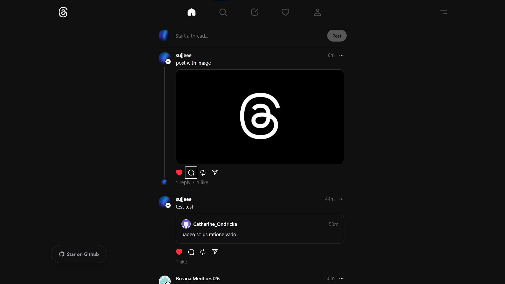
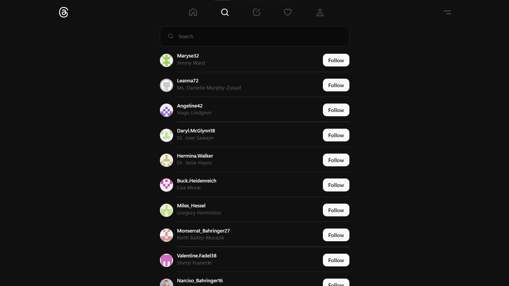
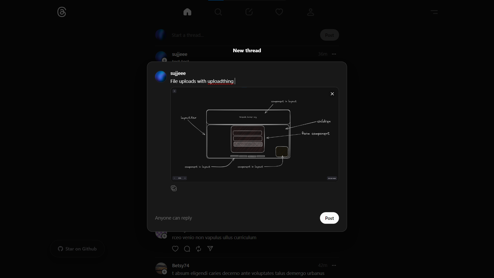
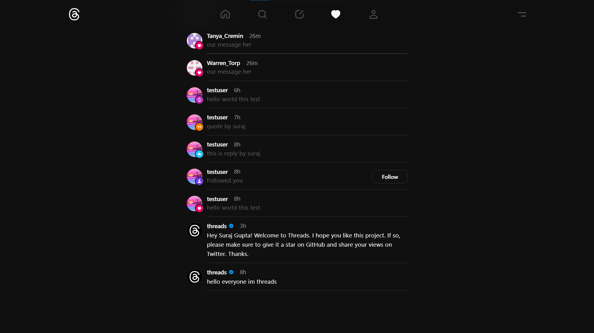
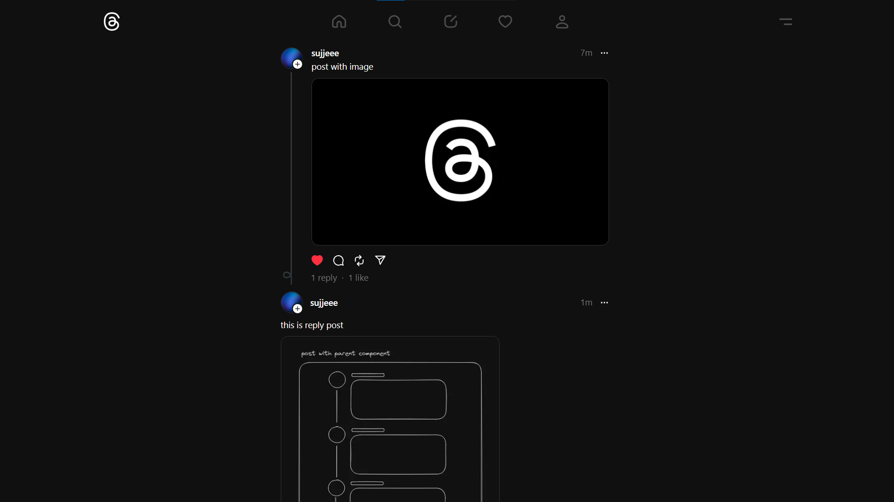
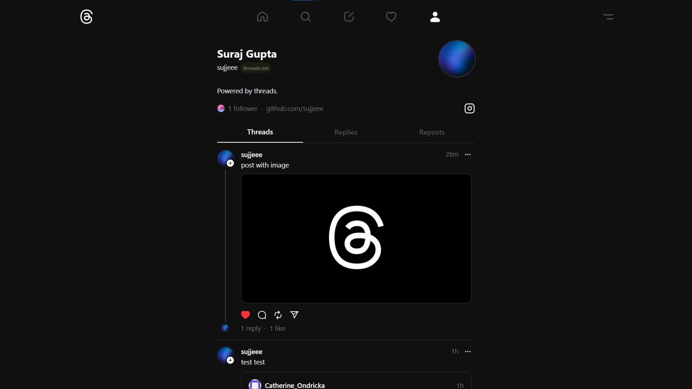

# [Threads clone](https://threads.codebustar.com)

This is an open source **threads-clone** build with ***`create-t3-app`*** and  everything new in Next.js 13 and 14.

|1. Feed Page |2. Search Page |
|:---:|:---:|
|  | |
| 3. Reply Card | 4. Notifications Page | 
|  | |
| 5. Post Info Page | 6. Profile Page |
|  | |


## Tech Stack

- **Framework:** [Next.js](https://nextjs.org)
- **Language:** [Typescript](https://www.typescriptlang.org/docs/)
- **Styling:** [Tailwind CSS](https://tailwindcss.com)
- **User Management:** [Clerk](https://clerk.com)
- **ORM:** [Prisma ORM](https://www.prisma.io/)
- **UI Components:** [shadcn/ui](https://ui.shadcn.com)
- **File Uploads:** [uploadthing](https://uploadthing.com)
- **Typesafe APIs:** [tRPC](https://trpc.io)
- **Hosting:** [Vercel](https://vercel.com/)

## Key Features

- Authentication with **Clerk**
- File uploads with **uploadthing**
- Advance **Prisma ORM** concepts
- Database on **Neon**
- Validation with **Zod**
- Text filteration with **bad-words**
- Image filteration with **nsfw-filter**
- Custom notifications on user interactions
- Custom component on top of  **shadcn/ui**
- Recursive threads with **prisma.$queryRaw**
- ***...and many more !***

## Running Locally

1. Clone the repository

   ```bash
   git clone https://github.com/sujjeee/threads-clone.git
   ```

2. Install dependencies using pnpm

   ```bash
   pnpm install
   ```

3. Copy the `.env.example` to `.env` and update the variables.

   ```bash
   cp .env.example .env
   ```

4. Start the development server

   ```bash
   pnpm run dev
   ```

5. Push the database schema

   ```bash
   pnpm run db:push
   ```
